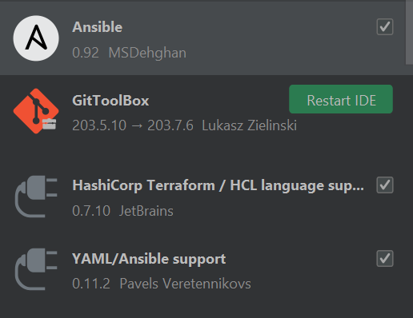

# Prerequisites

## Installing IntelliJ

1. Download Intellij Community Edition at the following link: 
   https://www.jetbrains.com/idea/download/#section=windows
2. Run the installer
3. Run through the installer as needed. There shouldn’t be any settings to change, 
   just hit “Next” until it installs.
4. Open IntelliJ

### Useful Plugins 

1. Download the following plugins
   + These will help formatting and will color code the file so it's easier to troubleshoot



## Installing and Setting up Git 

*GitHub is a website that allows for project sharing. A repository is created and 
files are added to the “main” or “develop” branch. Branches can be made off of other 
branches and each branch contains changes to the project that can be merged, called a 
pull request, into the parent branch by the owner(s) of the repository. Anyone who has
the project can easily pull changes made by other collaborators by using the `git pull` 
command.*

1. Open and follow the instructions on the site and use your STEAMPUNK email to sign 
   up: https://github.com/signup?ref_cta=Sign+up&ref_loc=header+logged+out&ref_page=%2F&source=header-home
2. For more information: https://guides.github.com/activities/hello-world/
3. Ask Alan Crouch for access to SteampunkFoundry: https://github.com/SteampunkFoundry
4. When access is given you should receive an email to login and gain access
5. For an explanation about GitOps and best practices: https://github.com/SteampunkFoundry/GitOpsTutorial/

## Installing Git Bash and Generating an SSH key 

*Note: Git Bash is only required for Windows. For Mac or Linux use default shell or 
shell of choice*

### Installing Git Bash (Windows)

Git Bash is an application for Windows environments which provides a Unix style 
terminal to make the Git command line experience more convenient. Git Bash 
is a package that installs Bash, some common bash utilities, and Git on a Windows 
operating system. 

1. Download Git bash from https://git-scm.com/downloads  
2. Follow the installer (defaults are ok) 
      
### Generating a SSH key 

We need to generate a SSH keypair that will be used to connect to GitHub so that we can
push and pull our code to the remote repository without using username/password or a personal access
token to authenticate every time. Visit [this page](https://docs.github.com/en/authentication/connecting-to-github-with-ssh/about-ssh)
more background information on the SSH protocol.

1. Open a terminal (Git Bash if on Windows) on your machine:
2. Use the command: `cd ~/.ssh` 
   this is the directory where you should store ssh keys
3. Run the command: `ssh-keygen -o`

The output should look something like this:

```javascript
PS C:\Users\<YourUser>> ssh-keygen -o
Generating public/private rsa key pair.
Enter file in which to save the key (C:\Users\<YourUser>/.ssh/steampunk_rsa):
Created directory 'C:\Users\<YourUser>/.ssh'.
Enter passphrase (empty for no passphrase):
Enter same passphrase again:
Your identification has been saved in C:\Users\<YourUser>/.ssh/steampunk_rsa.
Your public key has been saved in C:\Users\<YourUser>/.ssh/steampunk_rsa.pub.
The key fingerprint is:
SHA256:8dvoBlfJDSSVqwAfVFQwzx7LOJWApbCWBMH9y/xwlPc azuread\youruser@USER-LT
The key's randomart image is:
+---[RSA 3072]----+
|       ++oOB+.   |
|      o... B+    |
|       o..+.+*  .|
|   o.o +oB o=.o.o|
|      + S.+o.o  o|
|        ..o+  = E|
|         oo .  + |
|         ..     .|
|         ..      |
+----[SHA256]-----+
```

4. Run the command: `ls` to see what files have been generated  
You should have two files now, `steampunk_rsa` the private key, and `steampunk_rsa.pub` the public key. 
Private keys remain on your machine and **should never be shared**. In the next steps you will
add your **public key** to your GitHub account so that you can use the SSH  protocol to 
authenticate to your GitHub account.  
5. To view the public key run the command:  `cat ~/.ssh/steampunk_rsa.pub`
   + `cat` will show the contents of a file, in this case our public key
   + Copy the entire output
6. If more help is needed: https://git-scm.com/book/en/v2/Git-on-the-Server-Generating-Your-SSH-Public-Key
7. Open GitHub in a web browser, login, and go to **settings**
8. On the left side there is a tab titled: **SSH and GPG keys**
9. Select: **New SSH Key**
10. Copy the output from step 8 where we ran `cat <file>` and create a name for this key
11. Upon completion, you will need to enter your password to confirm
    
### Use Git Bash as terminal in IntelliJ (Optional, Windows Only)
 
*Recommended for Windows users who wish to use Git Bash, a Unix style command-line 
environment as their terminal in every IntelliJ window* 

1. Open IntelliJ, go to File > Settings 
2. Search for "Terminal"
3. Change "Shell Path" to where you installed Git Bash in step 1, for example 
   `C:\Program Files\Git\bin\bash.exe`
    
## Creating a Git Repository

1. Using a web browser go to https://github.com/SteampunkFoundry and hit the "+" button in the top right, 
   select “New repository”
2. Call your repository: **DevOpsforBeginners-<YOUR-NAME>** or something similar -- all 
   the work you do for this course will go in this repository 
3. Make your repository public
4. Select the `Add a README.md file`
5. Hit “Create repository”

## Cloning a Repository

1. Go to the repository you just created 
2. On the Code drop down menu, select SSH and copy the text
   + With the SSH option, GitHub will use your public/privat keypair to establish
     a connection and authenticate you to the remote repository. This method 
     is preferred, as with HTTPS you will be required to provide your username 
     and password everytime you push
   + This is going to allow us to access the repository from IntelliJ
   + For more information: https://github.com/SteampunkFoundry/GitOpsTutorial
3. In your IDE, open the terminal on the bottom.
   + Run: `cd Users\[your id]`
   + Run the command: `git clone [copied text]`
4. If successful, you should see the following: 

```javascript
$ git clone https://github.com/SteampunkFoundry/DevOpsforBeginners-<YOUR-NAME>.git
Cloning into 'DevOpsforBeginners-<YOUR-NAME>'...
remote: Enumerating objects: 30, done.
remote: Counting objects: 100% (30/30), done.
remote: Compressing objects: 100% (29/29), done.
remote: Total 30 (delta 7), reused 0 (delta 0), pack-reused 0
Unpacking objects: 100% (30/30), 1.79 MiB | 2.54 MiB/s, done.
```

5. To Verify, Go to the directory in File Explorer and `DevOpsforBeginners-<YOUR-NAME>` should 
   be a new folder

## Creating Changes and Creating a Pull Request

1. Open the README.md file
2. Within this file change the name to reflect the name of your Repository
3. Write a description for this repository 
4. Open the terminal in IntelliJ
   + Run the code: `git branch sampleBranch`
      + This creates the branch sampleBranch, which is currently a copy of the master or main
       branch
   + Run the code: `git checkout sampleBranch`
      + This allows you to make your changes to this new branch, to verify this worked check 
        the highlighted portion of your IDE. If it doesn’t say sampleBranch something went wrong
5. On the left middle side there should be 3 tabs, hit the **Commit** Tab.
6. Select the README, type a commit message, and hit **Commit and Push** and hit **Push** 
   when the window pops up
   [commit](!https://github.com/SteampunkFoundry/DevOpsForBeginnersCourse/blob/rachel-updates/imgs/commitTab.png )
7. Go to your repository in your web browser to make sure the branch was updated and then 
   hit **Compare and Request** to create a Pull Request 
